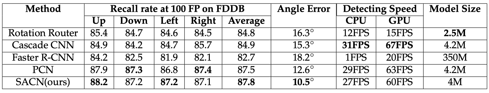

# SACN : Pytorch implementation

Pytorch implementation of Searching Architecture Calibration Network by AnPing Song et al.

# Based On

[Real-Time Rotation-Invariant Face Detection with Progressive Calibration Networks](https://arxiv.org/pdf/1804.06039.pdf) -- XuePeng Shi et al.

[Darts: Differentiable architecture search](https://arxiv.org/abs/1806.09055) -- HanXiao Liu et al.

# DataSet
DataSet : [FDDB](http://vis-www.cs.umass.edu/fddb/)

# Requirement
pytorch : 0.3.0

# Result
